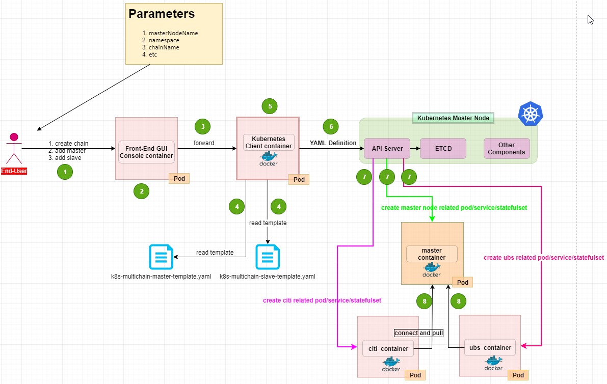

# KubernetesClient
> A simple project to receive the user input and fill the template file to setup blockchain system based on multichain and corda currently and maybe other blockchain products in the future

### Introduction
> By using this project we provide a simple way to create kubernetes resources to setup master node and slave node for multichain system and also corda system

This is just a sub-project of the MLBaaSPlatform , please refer to https://github.com/menglong567/MLBaaSPlatfrom for the whole picture of the BaaS

### Architecture
> Here i'm giving the whole picture of this simple project as below

### Support or Contact
> If you have question please contact me via menglong567@aliyun.com
